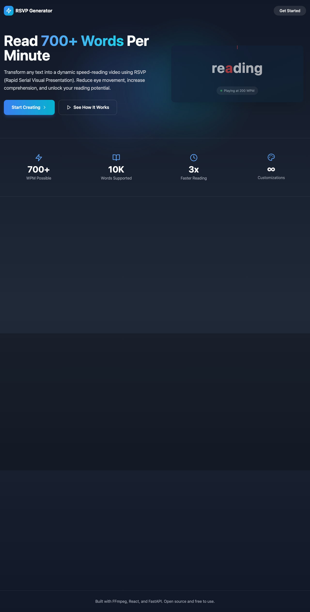
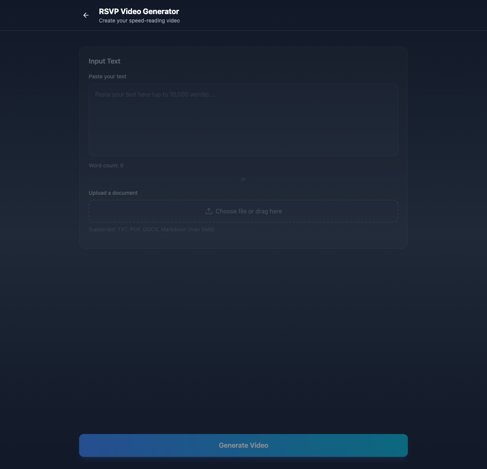
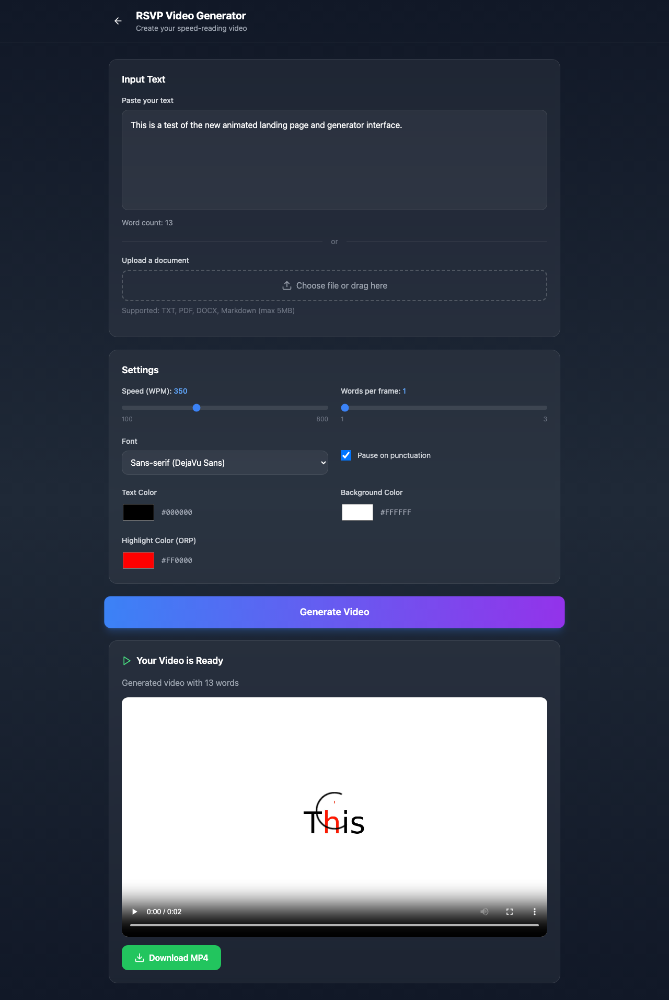

<h1 align="center">RSVP Video Generator</h1>

<p align="center">
  <strong>Transform text into dynamic speed-reading videos using Rapid Serial Visual Presentation</strong>
</p>

<p align="center">
  
  
  
  
  
  
  
  
  
</p>

<p align="center">
  A web application that converts text into RSVP (Rapid Serial Visual Presentation) videos for speed reading. Upload documents or paste text, customize settings, and generate MP4 videos that display words sequentially at speeds up to 800 WPM with optimal recognition point highlighting.
</p>

<p align="center">
  <a href="#features">Features</a> •
  <a href="#screenshots">Screenshots</a> •
  <a href="#quick-start">Quick Start</a> •
  <a href="#configuration">Configuration</a> •
  <a href="#tech-stack">Tech Stack</a>
</p>

---

## Features

- **Text Input** - Paste text directly or upload documents (TXT, PDF, DOCX, Markdown)
- **Speed Control** - Adjustable reading speed from 100 to 800 words per minute
- **ORP Highlighting** - Optimal Recognition Point highlighting for faster word recognition
- **Custom Colors** - Configurable text, background, and highlight colors
- **Font Selection** - Choose between sans-serif, serif, and monospace fonts
- **Punctuation Pauses** - Automatic pauses on periods, commas, and other punctuation
- **Word Grouping** - Display 1-3 words per frame for different reading levels
- **Video Preview** - Preview generated videos directly in the browser
- **MP4 Export** - Download high-quality 1080p MP4 video files
- **Responsive Design** - Works seamlessly on desktop and mobile devices
- **Animated Landing Page** - Engaging, modern UI with live RSVP demonstration
- **Docker Deployment** - One-command deployment with Docker Compose

## Screenshots

<p align="center">
  
  <br/>
  <em>Animated Landing Page with Live RSVP Demo</em>
</p>

<p align="center">
  
  <br/>
  <em>Video Generator with Customization Options</em>
</p>

<p align="center">
  
  <br/>
  <em>Generated Video Preview with Download</em>
</p>

## Tech Stack

### Frontend
- **React 18** - Modern UI framework with hooks
- **TypeScript** - Type-safe development
- **Vite** - Fast build tooling
- **Tailwind CSS** - Utility-first styling
- **Framer Motion** - Smooth animations
- **Lucide Icons** - Beautiful icon library

### Backend
- **FastAPI** - High-performance Python API framework
- **Pillow** - Image frame generation
- **FFmpeg** - Video encoding and assembly
- **PyPDF2** - PDF text extraction
- **python-docx** - DOCX text extraction

### Infrastructure
- **Docker** - Containerized deployment
- **Nginx** - Production web server and reverse proxy
- **Docker Compose** - Multi-container orchestration

## Quick Start

### Prerequisites
- Docker and Docker Compose

### Installation

1. **Clone the repository**
   ```bash
   git clone https://github.com/yourusername/RSVP.git
   cd RSVP
   ```

2. **Build and run with Docker**
   ```bash
   docker compose up -d --build
   ```

3. **Access the application**

   Open your browser to `http://localhost:47293`

### Stopping the Application

```bash
docker compose down
```

## Configuration

### Video Settings

| Setting | Description | Default | Range |
|---------|-------------|---------|-------|
| `WPM` | Words per minute | 300 | 100-5000 |
| `Word Grouping` | Words per frame | 1 | 1-3 |
| `Font` | Display font | Sans-serif | Sans/Serif/Mono |
| `Text Color` | Word color | #000000 | Any hex |
| `Background Color` | Video background | #FFFFFF | Any hex |
| `Highlight Color` | ORP highlight | #FF0000 | Any hex |
| `Pause on Punctuation` | Pause at sentences | Enabled | On/Off |

### Speed Zones

| Zone | WPM Range | ms/word | Description |
|------|-----------|---------|-------------|
| 🟢 Beginner | 100-300 | 200-600ms | Comfortable learning pace |
| 🔵 Normal | 300-500 | 120-200ms | Average reading speed |
| 🔷 Advanced | 500-800 | 75-120ms | Fast, still comprehensible |
| 🟡 Pro | 800-1200 | 50-75ms | Edge of comprehension |
| 🟠 Ultra | 1200-2000 | 30-50ms | Reduced comprehension |
| 🔴 Non-Human | 2000-5000 | 12-30ms | Beyond human perception |

> ⚠️ **Note**: Speeds above 1200 WPM exceed typical human reading capabilities. The "Non-Human" zone (2000+ WPM) displays words faster than the human visual system can process for comprehension.

### Supported File Formats

| Format | Extension | Max Size |
|--------|-----------|----------|
| Plain Text | `.txt` | 5MB |
| Markdown | `.md` | 5MB |
| PDF | `.pdf` | 5MB |
| Word Document | `.docx` | 5MB |

### Limits

- Maximum words: 100,000 per video
- Maximum file size: 5MB
- Video resolution: 1920x1080 (1080p)
- Video codec: H.264 (MP4)

## Usage

### Creating a Video from Text

1. Navigate to the generator page
2. Paste your text in the input area
3. Adjust settings (speed, colors, font)
4. Click "Generate Video"
5. Preview the video
6. Download the MP4 file

### Creating a Video from a Document

1. Navigate to the generator page
2. Click "Choose File" or drag a document
3. Supported formats: TXT, PDF, DOCX, Markdown
4. Adjust settings as needed
5. Click "Generate Video"
6. Preview and download

### Understanding ORP

The **Optimal Recognition Point (ORP)** is highlighted in each word to guide your eye to the best fixation point for rapid recognition. This technique is a key component of RSVP that helps reduce eye movement and increase reading speed.

## Development

### Local Development Setup

1. **Backend**
   ```bash
   cd backend
   python -m venv venv
   source venv/bin/activate
   pip install -r requirements.txt
   uvicorn app.main:app --reload --port 8000
   ```

2. **Frontend**
   ```bash
   cd frontend
   npm install
   npm run dev
   ```

### Project Structure

```
RSVP/
├── backend/
│   ├── app/
│   │   ├── __init__.py
│   │   └── main.py          # FastAPI application
│   ├── requirements.txt
│   └── Dockerfile
├── frontend/
│   ├── src/
│   │   ├── components/
│   │   │   ├── LandingPage.tsx
│   │   │   └── Generator.tsx
│   │   ├── App.tsx
│   │   ├── main.tsx
│   │   └── index.css
│   ├── package.json
│   ├── nginx.conf
│   └── Dockerfile
├── docker-compose.yml
└── README.md
```

### API Endpoints

| Method | Endpoint | Description |
|--------|----------|-------------|
| GET | `/api/health` | Health check |
| POST | `/api/generate` | Generate RSVP video |
| GET | `/api/download/{job_id}` | Download generated video |

### API Request Example

```bash
curl -X POST "http://localhost:47293/api/generate" \
  -F "text=Your text here" \
  -F "wpm=300" \
  -F "font=arial" \
  -F "text_color=#000000" \
  -F "bg_color=#FFFFFF" \
  -F "highlight_color=#FF0000" \
  -F "pause_on_punctuation=true" \
  -F "word_grouping=1"
```

## How RSVP Works

**Rapid Serial Visual Presentation (RSVP)** is a speed reading technique that displays words one at a time in a fixed position. This method:

1. **Eliminates eye movement** - Words appear in the same spot, so your eyes don't need to scan across lines
2. **Reduces subvocalization** - The rapid pace discourages "inner voice" reading
3. **Focuses attention** - Single-word display maximizes concentration
4. **Highlights fixation points** - ORP marking shows where to focus within each word

Research suggests RSVP can enable reading speeds of 700+ WPM while maintaining comprehension for practiced users.

## Troubleshooting

### Video generation fails

- Ensure text doesn't exceed 100,000 words
- Check that uploaded files are under 5MB
- Verify file format is supported (TXT, PDF, DOCX, MD)

### Container health check fails

- Wait a few seconds for the backend to fully start
- Check logs: `docker compose logs backend`

### Video doesn't play in browser

- Ensure your browser supports H.264/MP4
- Try downloading and playing locally

## License

MIT License - see LICENSE file for details.

---

<p align="center">
  Built with ❤️ using React, FastAPI, and FFmpeg
</p>
